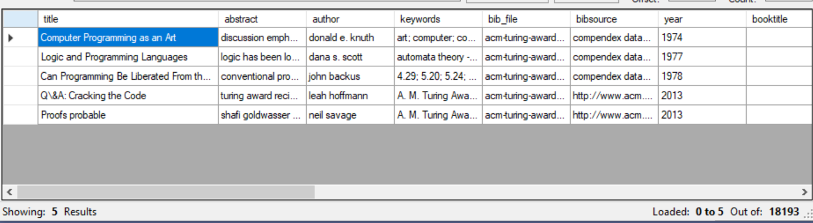

# Datasets 


| Dataset      | Source                                                                               | Files              | \# of docs                       | Type                    | ------------ | ------------------------------------------------------------------------------------ | ------------------ | -------------------------------- | ------------------------ | -------------------------------------------------------------------------------------------------------------------------------------- |
| Bib dataset  | Parsed from<br>TUG bibliography archive                                              | Parquet format     | 18,193                           | Abstracts<br>Meta-data   |
| Text Dataset | Parsed from Keyphrase datasets:<br>\- NUS<br>\- ACM<br>\- KDD<br>\- WWW<br>\- Inspec | Parquet format<br> | 6,600<br>train, validation, test | Abstracts<br>Full papers |

The dataset has 18,193 processed document. Each entry has 22 attributes. The list of attributes represents values that appear in a bib record.

The following is example of 5 records and only part of the attributes stored: 



## Dataset creation and extension 
Millions of Bib records can be processed using teh file `ProcessBib.py`. Which efficiently process, parse, and store the needed information. It can extract missing abstract by calling functions from `get_abstract.py`, which calls "Microsoft Academic" library and fetch the abstract. 

The code simply requires setting a few variables 

```python
bib_list = "names.txt" #Bib files paths
failed_files = "error_name.txt" #Names of files failed to be processed 
outputFilePath = "bib_tug_dataset_full.parquet" #output file

max_entries = 30000 #Maximum number of docs
extract_abstract = False #Fetch abstract from the web
```

Similarly `ProcessText.py` is designed to process text based datasets, where only the documents and the keyphrases are stored. 
