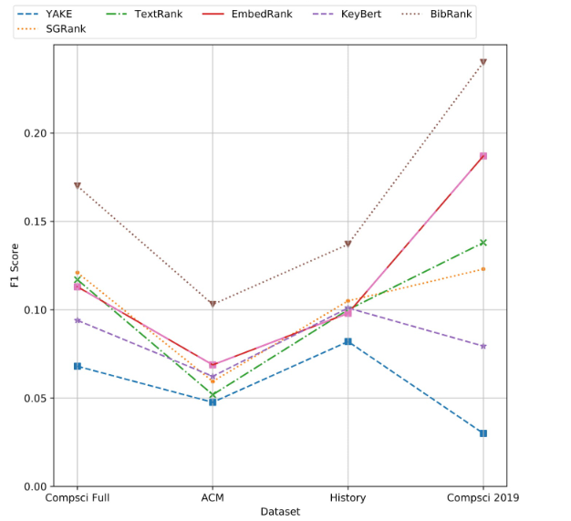

# BibRank: Automatic Keyphrase Extraction Platform Using Metadata

BibRank, a new semi-supervised automatic keyphrase extraction method that exploits an information-rich dataset collected by parsing bibliographic data in BibTeX format.

This repository contains BibRank implementation, Bib dataset, a platform to support datasets creation, different models processing, and running different evaluations. 


## Installation 

### 1. install all required dependencies. 

```
pip install -r requirements.txt
```
### 2. install extra dependencies for specific models. 

- Download and install dependencies for Embedrank

    Using their Github repo: https://github.com/AnzorGozalishvili/unsupervised_keyword_extraction


- BibRank and PositionRank use Standford CoreNLP Toolkit

    Download: https://stanfordnlp.github.io/CoreNLP/download.html

## Example 
`Models Evaluation.ipynb` notebook has examples for different models evaluations.

### Data 

Bib dataset was used for evaluation and for generating the weights used by BibRank model. The dataset contains 18,193 documents where their titles, abstracts, and other metadata stored. 

Another data file was created which includes data from 5 frequently used keyprhase extraction datasets. 

The repository contains code to load, process, and create/ extend datasets. 

More information about datasets can be found [here](Datasets/README.md). 


### Models 
The platform includes the implementation of the newly proposed method BibRank.  In addition, it includes  18 different keyphrase methods implementation. 

More information about the models can be found [here](Models/README.md). 

### Evaluation

To run an experiment using BibRank model. The following code can be used: (Code Included in the `Models Evaluation.ipynb` notebook)

First, the Stanford CoreNLP should be run using the following command:
```
java -mx1g -cp "*" edu.stanford.nlp.pipeline.StanfordCoreNLPServer -port 9000 -timeout 15000

```

Then the following code can be run from the main directory. 
```python
import sys
from Models import *
from KeyEval import *

bib_weights= {"dataset":"Datasets/DataFiles/bib_tug_dataset_full.parquet", 
              "year1":1980, "year2":1986, "types":["compsci"]} #Defines weights data parameters 
model = BibRank()
all_scores, all_scores_adjust = eval_file("Datasets/DataFiles/bib_tug_dataset_full.parquet", 
                                           model,model_param = ["weights from 1980 1986"] ,
                                           year1=1988, year2=1990, types=["compsci"] , 
                                           bib_weights=bib_weights, log=True)

```

`all_scores` evaluation scores F1, recall, precision, Rprecision (in order)
`all_scores_adjust` same list of scores, but adjusted according to terms that appear in the document only. 

The code first defines the parameters used to generate the Bib weights. Then, it runs an evaluation using a different set of parameters. 
Bib weights are only used with BibRank model. Other models can be evaluated using the same code with changing the model initialization (Examples are in the notebook). 
Output summary is stored in file `output.tsv`, and detailed information is stored in file `output.json`. This can be ignored if `log` is set to False. 

## Results 

We have benchmarked BibRank and state-of-the-art techniques against the dataset. The evaluation indicates that BibRank is more stable and has a better performance than state-of-the-art methods.



## Directory Structure
```

│   KeyEval.py
|   Models Evaluation.ipynb
│   output.json
│   output.tsv
│   requirements.txt
│
├───Datasets
│   │   bib_info.json
│   │   error_name.txt
│   │   get_abstract.py
│   │   names.txt
│   │   ProcessBib.py
│   │   ProcessText.py
│   │   utils.py
│   │
│   ├───DataFiles
│   │       bib_tug_dataset_full.parquet
│   │       text_dataset_full.parquet
│   │
└───Models
    │   Models.py
    │   position_rank.py
    │   test_position.py
    │   tokenizer.py
    
```
